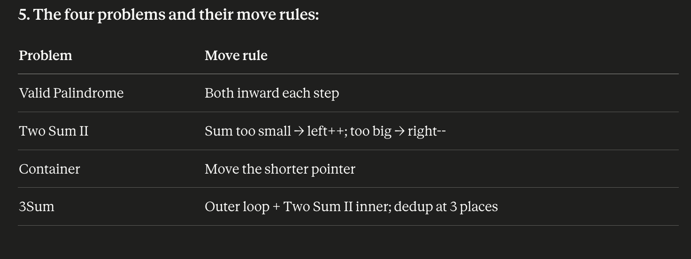

# Patterns

## Grid chunking / 2D-to-1D indexing

**Recognize:** problem partitions a 2D grid into fixed-size blocks (sudoku boxes,
image patches, matrix tiles) and needs per-block state.

**Pattern:**
- Cell (i, j) in k×k chunks → chunk coords = (i // k, j // k)
- Flatten to 1D index → (i // k) * (num_chunks_per_row) + (j // k)

**Seen in:** Valid Sudoku (k=3, 9 boxes flattened to indices 0–8)

**Bug watch:** off-by-one on `num_chunks_per_row` vs `num_cols`. They're equal
only when the grid is exactly k×k chunks wide. Tabulate 2–3 (i, j) → index
mappings before trusting the formula.

## Set + chain walking (NOT sliding window)

**Recognize:** "longest consecutive / sequential / chain" over an *unsorted*
collection where elements don't need to be contiguous in the input. The O(n)
requirement rules out sort.

**Pattern:**
1. Dump everything into a set (O(1) lookup).
2. Iterate the set. For each element `n`, check if `n - 1` is in the set.
3. If `n - 1` is absent, `n` is a chain-start → walk forward (`n+1`, `n+2`, ...)
   counting length until you fall off.
4. Track global max.

**Why O(n):** every element is touched at most twice — once by the outer scan,
once by exactly one inner walk (the walk that starts at its chain's head). The
nested loop looks like O(n²) but is amortized O(n). Have this sentence ready
for interviewers.

**Seen in:** LeetCode 128 Longest Consecutive Sequence

**Bug watch:**
- Iterate the *set*, not the input list, or duplicates do redundant work.
- The chain-start check is `n - 1 not in set`, not `n + 1 not in set`.

## Two Pointer s

1. Three types, by configuration:

Opposite ends → pointers at [0, n-1], move inward
Fast/slow → both start left, fast moves quicker
Two sequences → one pointer per array

2. When you see one:

Sorted array + looking for a pair → opposite ends
In-place array edit or cycle → fast/slow
Merging two sorted things → two sequences

3. The one question that gives you the move rule:

Which pointer, if I keep it, can never beat what I've already seen?

Move that one.
4. Termination check:
Every loop iteration must move some pointer. If a code path doesn't, you have an infinite loop.

